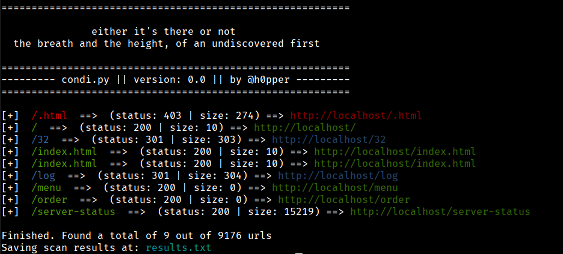

# Condi

A simple Content Discovery/Directory Brute-forcing tool written in python3. Nothing new or special about it, except that it is mine.  

### Installation

If using Python 3.11

```bash
sudo apt install python3-requests python3-termcolor
```

### Basic Usage

Basic scan that adds checks for .html extension and saves findings to results.txt  

```bash
./condi.py -u http://localhost -w wordlist.txt -x html -o results.txt
```


When a scan is interrupted (CTRL + C) a session restore file will be created in the user's home directory with the name .condi.restore(the file will be hidden).  


The restore file can be used to resume the session.

```bash
./condi.py -r
```


A simple Content Discovery/Directory Brute-forcing tool written in python3.  
Nothing new or special about it, except that it is mine.

### Installation

If using Python 3.11

```bash
sudo apt install python3-requests python3-termcolor
```

## TODO
- [ ] Add option to include/exclude status codes
- [ ] Add option to set a User-Agent
